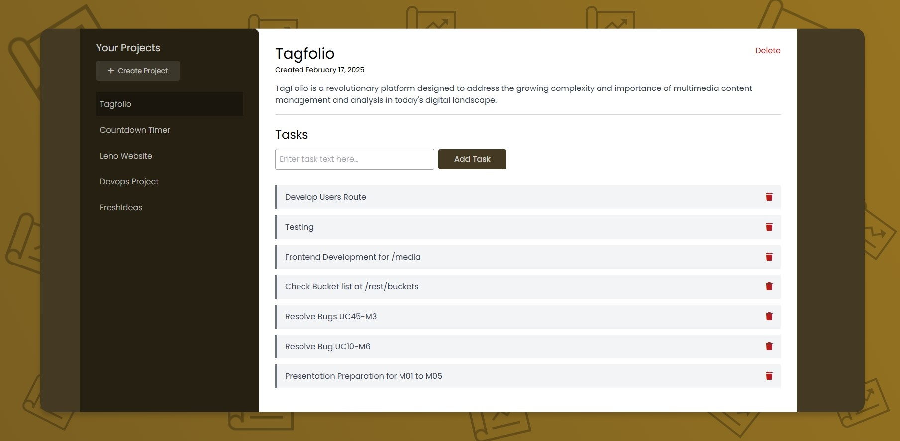

# Project Manager  
### Efficient Task and Team Management Solution  

Project Manager is a web-based application built with React and modern frontend technologies to streamline task and team management. It provides an intuitive interface for organizing projects, assigning tasks, and tracking progress in real time. With features like project creation and task management, this app is designed for seamless integration with existing workflows and ensures a smooth user experience. Whether managing small teams or large projects, Project Manager simplifies coordination and boosts efficiency.  



## Technologies  

- **HTML5** – Provides the structural foundation for the application's user interface.  
- **CSS3** – Styles the UI, ensuring a visually appealing and responsive design.  
- **Tailwind CSS** – Simplifies styling with utility-first classes for a clean and consistent look.  
- **JavaScript** – Powers the application's interactivity and dynamic behavior.  
- **React** – Enables efficient component-based development for a seamless user experience.  
- **Node.js** – Powers the backend, enabling server-side operations and API handling.  
- **npm** – Manages project dependencies and scripts for smooth development and deployment.
- **Vite** – Provides a fast and efficient development environment, enabling quicker build times and improved performance for React applications.  


## Installation  

Follow these steps to set up and run the Project Manager app locally (Make sure you have Node.js and npm installed before running the commands):  

1. **Clone the repository:**  
   ```sh
   git clone https://github.com/Ummamali/projectmanager.git
   cd projectmanager

2. **Install dependencies:**
    ```sh
    npm install
    
3. **Start the development server:**
     ```sh
     npm run dev

## Features  

- **Create Project**  
  - Add new projects effortlessly  
  - Provide a detailed project description  
  - Organize projects for better management  

- **Add Tasks in Project**  
  - Assign tasks within a project  
  - Set deadlines and priorities  
  - Track progress in real-time  

- **Delete Tasks When Completed**  
  - Remove completed tasks easily  
  - Keep the workspace clutter-free  
  - Maintain focus on pending tasks

## License  

This project is licensed under the **MIT License** – see the [LICENSE](LICENSE) file for details.  

- **Delete Project**  
  - Remove entire projects when no longer needed  
  - Ensure outdated projects don’t clutter the workspace  
  - Permanently delete all associated tasks  

